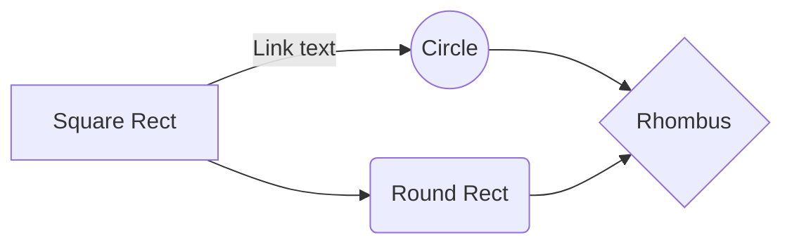
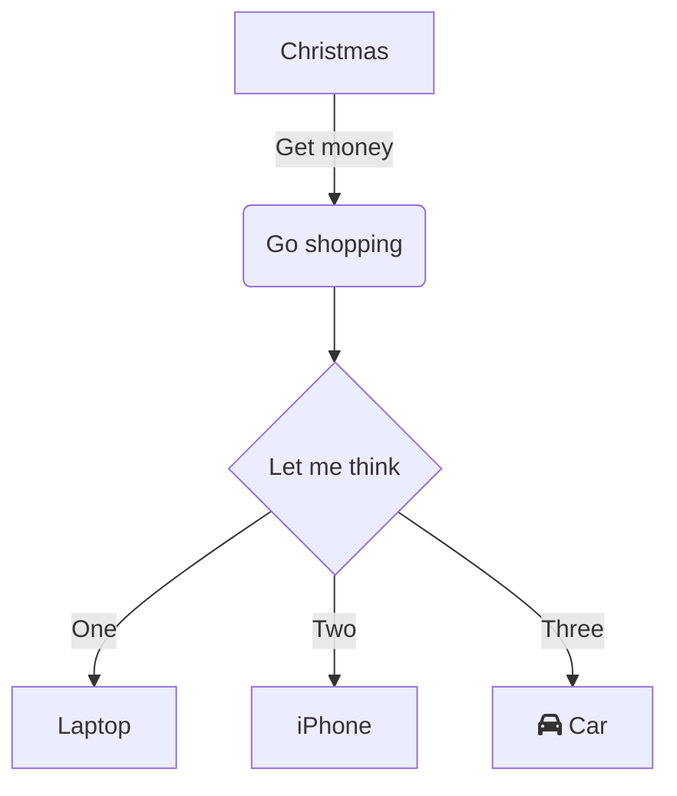
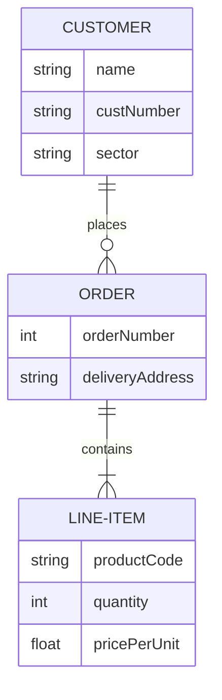
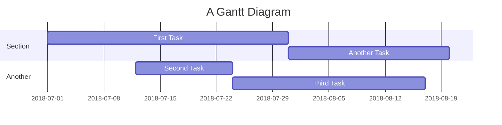
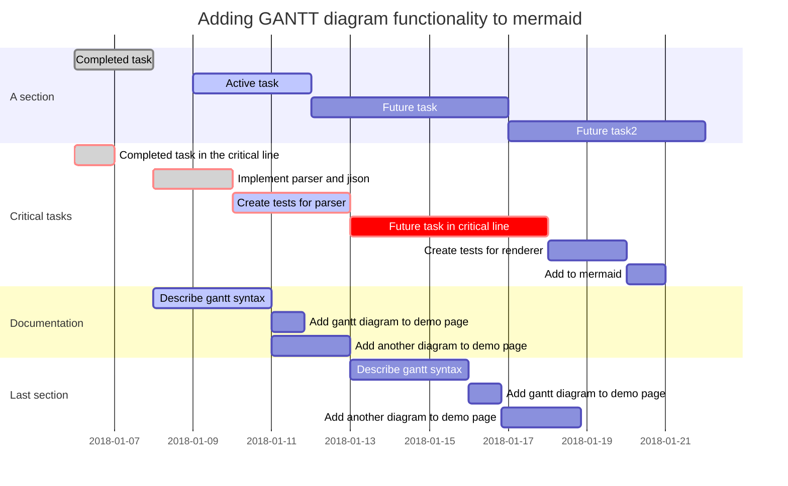

# TIPI DI MERMAID

### FLOWCHART

- TOP-DOWN

```mermaid
graph TD;
    A-->B;
    A-->C;
    B-->D;
    C-->D;
```

- LEFT-RIGHT

```mermaid
graph LR
    A[Square Rect] -- Link text --> B((Circle))
    A --> C(Round Rect)
    B --> D{Rhombus}
    C --> D
```

## FLOWCHART WITH DECISION

```mermaid
graph TD
    A[Christmas] -->|Get money| B(Go shopping)
    B --> C{Let me think}
    C -->|One| D[Laptop]
    C -->|Two| E[iPhone]
    C -->|Three| F[fa:fa-car Car]
```

# FLOWCHART DATA

```mermaid
erDiagram
    CUSTOMER ||--o{ ORDER : places
    CUSTOMER {
        string name
        string custNumber
        string sector
    }
    ORDER ||--|{ LINE-ITEM : contains
    ORDER {
        int orderNumber
        string deliveryAddress
    }
    LINE-ITEM {
        string productCode
        int quantity
        float pricePerUnit
    }
```

## GRAFICI GANTT

```mermaid

gantt
    title A Gantt Diagram
    dateFormat  YYYY-MM-DD
    section Section
    First Task       :a1, 2018-07-01, 30d
    Another Task     :after a1, 20d
    section Another
    Second Task      :2018-07-12, 12d
    Third Task       : 24d

```

- VERSIONE ESAGERATA

```mermaid

gantt
       dateFormat  YYYY-MM-DD
       title Adding GANTT diagram functionality to mermaid

       section A section
       Completed task            :done,    des1, 2018-01-06,2018-01-08
       Active task               :active,  des2, 2018-01-09, 3d
       Future task               :         des3, after des2, 5d
       Future task2              :         des4, after des3, 5d

       section Critical tasks
       Completed task in the critical line :crit, done, 2018-01-06,24h
       Implement parser and jison          :crit, done, after des1, 2d
       Create tests for parser             :crit, active, 3d
       Future task in critical line        :crit, 5d
       Create tests for renderer           :2d
       Add to mermaid                      :1d

       section Documentation
       Describe gantt syntax               :active, a1, after des1, 3d
       Add gantt diagram to demo page      :after a1  , 20h
       Add another diagram to demo page    :doc1, after a1  , 48h

       section Last section
       Describe gantt syntax               :after doc1, 3d
       Add gantt diagram to demo page      :20h
       Add another diagram to demo page    :48h

```
