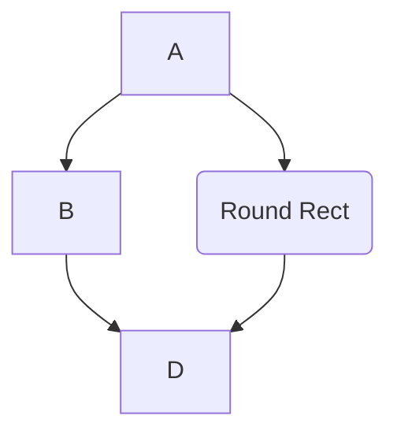
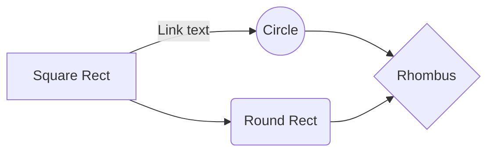
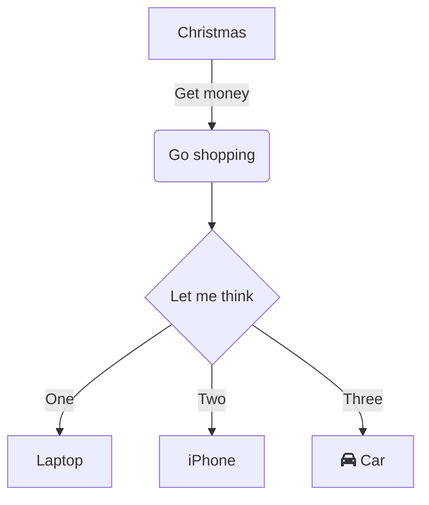
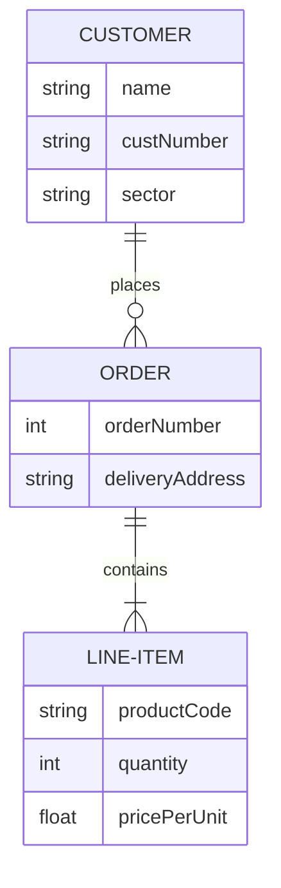
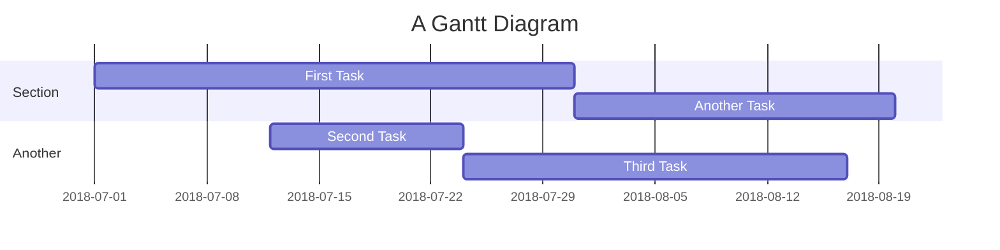
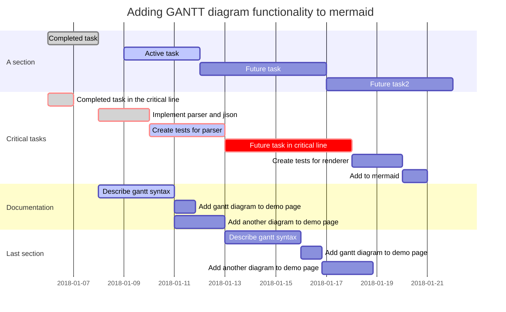

# TIPI DI MERMAID

### FLOWCHART

- TOP-DOWN



````C#
/*
```mermaid
graph TD;
    A-->B;
    A-->C(Round Rect);
    B-->D;
    C-->D;
*/
````

```C#
/*
 This code is written in Mermaid syntax for creating a flowchart. This flowchart visualizes the relationships and flow between different nodes (or steps). Here's a detailed explanation:

Nodes and Connections
A: This is the starting node.
B: This is a node that is connected from A.
C(Round Rect): This is another node connected from A. The label (Round Rect) indicates that this node is visually represented as a round rectangle.
D: This is a node that is connected from both B and C.


Relationships
A-->B: There is a directional link from A to B.
A-->C(Round Rect): There is a directional link from A to C, where C is a round rectangle.
B-->D: There is a directional link from B to D.
C-->D: There is a directional link from C to D.


Visual Representation

The flowchart can be visualized as follows:

A is the starting point, leading to two branches.
From A, one branch goes to B.
Another branch goes from A to C, which is a round rectangle.
B then connects to D.
C also connects to D.


Summary
This flowchart represents a process where:

The process starts at A.
From A, it can go to either B or C.
Both B and C converge into D, indicating that D depends on the completion of both B and C.
This kind of flowchart is useful for visualizing decision points, parallel processes, and convergence points in a workflow or process.
*/
```

- LEFT-RIGHT



## FLOWCHART WITH DECISION



# FLOWCHART DATA



````C#
/*
```mermaid
erDiagram
    CUSTOMER ||--o{ ORDER : places
    CUSTOMER {
        string name
        string custNumber
        string sector
    }
    ORDER ||--|{ LINE-ITEM : contains
    ORDER {
        int orderNumber
        string deliveryAddress
    }
    LINE-ITEM {
        string productCode
        int quantity
        float pricePerUnit
    }
*/
````

```C#
/*
This code is written in Mermaid syntax, specifically for creating an Entity-Relationship (ER) diagram. ER diagrams are used to model the data and relationships in a database system. Here's an explanation of the diagram:

Entities and Relationships

Entities


CUSTOMER
Attributes:
name: A string representing the customer's name.
custNumber: A string representing the customer's unique identification number.
sector: A string representing the sector or industry the customer belongs to.


ORDER
Attributes:
orderNumber: An integer representing the unique identification number of the order.
deliveryAddress: A string representing the address where the order should be delivered.


LINE-ITEM
Attributes:
productCode: A string representing the code of the product.
quantity: An integer representing the number of units of the product.
pricePerUnit: A float representing the price per unit of the product.


Relationships


CUSTOMER ||--o{ ORDER
This relationship indicates that a customer can place many orders (one-to-many relationship).
The symbol ||--o{ means that one CUSTOMER can be associated with zero or more ORDERS, but each ORDER is associated with exactly one CUSTOMER.


ORDER ||--|{ LINE-ITEM
This relationship indicates that an order can contain many line items (one-to-many relationship).
The symbol ||--|{ means that one ORDER can be associated with zero or more LINE-ITEMs, but each LINE-ITEM is associated with exactly one ORDER.


Visual Representation


CUSTOMER entity has attributes: name, custNumber, and sector.
ORDER entity has attributes: orderNumber and deliveryAddress.
LINE-ITEM entity has attributes: productCode, quantity, and pricePerUnit.


Relationships in Detail:
A CUSTOMER can place multiple ORDERs, but each ORDER is placed by one CUSTOMER.
An ORDER can contain multiple LINE-ITEMs, but each LINE-ITEM belongs to one ORDER.


Diagram Structure
CUSTOMER entity is connected to ORDER entity with a one-to-many relationship.
ORDER entity is connected to LINE-ITEM entity with a one-to-many relationship.


This ER diagram helps in understanding the structure of a database where customers place orders, and each order consists of multiple line items. It shows how entities are related and the attributes that describe them.
*/
```

## GRAFICI GANTT



````C#
/*
```mermaid

gantt
    title A Gantt Diagram
  #   dateFormat  YYYY-MM-DD
    section Section
    First Task       :a1, 2018-07-01, 30d
    Another Task     :after a1, 20d
    section Another
    Second Task      :2018-07-12, 12d
    Third Task       : 24d

*/
````

```c#
/*
A Gantt chart is a type of bar chart that represents a project schedule. It shows the start and finish dates of various elements of a project. The code you've provided is written in Mermaid syntax, which is a tool used to generate diagrams and flowcharts from text descriptions.

Here's a breakdown of the Gantt chart you've described:

Title
The title of the Gantt chart is "A Gantt Diagram".

Date Format
The date format used in the chart is YYYY-MM-DD.

Sections and Tasks
The chart is divided into sections, each containing tasks with specified durations and dependencies.

Section: Section

First Task
Identifier: a1
Start Date: 2018-07-01
Duration: 30 days
Displayed as: First Task

Another Task
Dependency: after a1 (This task starts after the First Task ends)
Duration: 20 days
Displayed as: Another Task

Section: Another

Second Task
Start Date: 2018-07-12
Duration: 12 days
Displayed as: Second Task

Third Task
No specific start date is given, so it starts after the previous task in the section (which is Second Task).
Duration: 24 days
Displayed as: Third Task

Visual Representation

First Task: Starts on July 1, 2018, and lasts for 30 days, so it ends on July 30, 2018.
Another Task: Begins after First Task ends, so it starts on July 31, 2018, and lasts for 20 days, ending on August 19, 2018.
Second Task: Starts on July 12, 2018, and lasts for 12 days, ending on July 24, 2018.
Third Task: Starts immediately after Second Task ends (if no start date is specified), so it starts on July 25, 2018, and lasts for 24 days, ending on August 17, 2018.

This Gantt chart helps visualize the project schedule, showing when each task starts and ends, and the dependencies between tasks.
*/
```

- VERSIONE ESAGERATA


