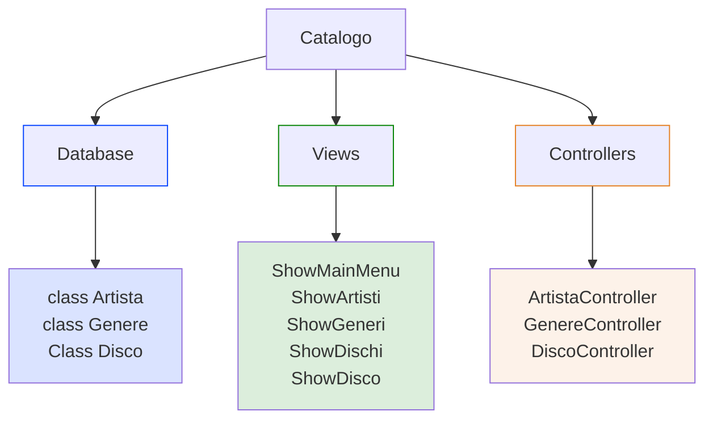
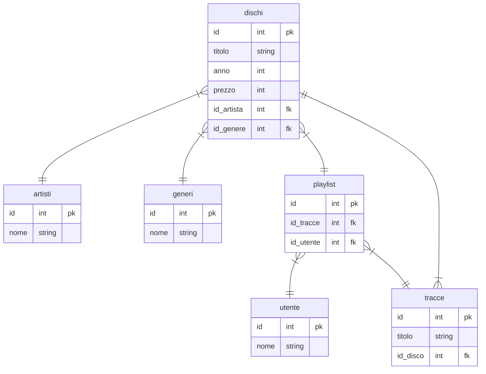

# PROGETTO CATALOGO DISCHI

Applicazione utilizzata per il catalogo di dischi musicali, inseriti in un database memorizzandone titolo, artista, anno di pubblicazione e genere. Anche prezzo nel caso l'applicazione venga utilizzata come catalogo per un negozio di vendita di dischi.

## PUBBLICO TARGET
- L'applicazione può essere usata sia dagli utenti che vogliono tenere memorizzato il proprio catalogo di dischi, dai privati ai collezzionisti, sia da un negozio di vendita di dischi, il quale dovrà tenere memoria del proprio catalogo disponibile.

## DEFINIZIONE DEI REQUISITI E ANALISI

- [x] L'applicazione non necessita di un login da parte dell'utente.
- [x] L'applicazione consente all'utente di inserire, rimuovere, modificare o eliminare dischi dal catalogo, ma anche di inserire/modificare i singoli artisti o generi musicali.
- [x] L'applicazione deve consentire all'utente di visualizzare l'elenco dei dischi, degli artisti e dei generi memorizzati.
- [x] L'applicazione deve poter gestire il corretto inserimento dei campi da memorizzare.
- [x] L'applicazione deve evitare l'inserimento di dati rindondanti (stessi artisti/generi o stesso album dello stesso artista).

### utilizzare

- [x] classi (artista, album, genere)
- [x] entity framework
- [x] pattern MVC (database, view, controller)
- [x] utilizzare un controller per ogni tabella, cosi lo creo per una tabella e lo copio per le altre due

## FUNZIONALITA' PER TABELLA Dischi

- [x] DischiController
    - [x] aggiungere disco
    - [x] rimuovere disco
    - [x] modificare disco

- [x] DischiView
    - [x] mostrare elenco dischi
        - [ ] per anno
        - [ ] per prezzo
        - [ ] per artista
        - [ ] per genere
    - [ ] mostrare panoramica singolo disco

- [x] idem per tabella artista e genere

### - MIGLIORAMENTI:
- [x] STAMPA NOME ARTISTA ANZICHE ID ARTISTA QUANDO STAMPI DISCHI
- [x] MOSTRA ELENCO GENERI DURANTE INSERIMENTO IN ADD DISCO
- [x] INSERIRE NOME ARTISTA ANZICHE ID (ma la tabella memorizza l'Id artista)
- [x] STAMPA DISCHI IN TABELLA ORDINATA (calcola spazi vuoti necessari)
- [ ] AGGIUNGERE CAMPO PER NUMERO DI COPIE DISPONIBILI PER DISCO

## PIANIFICAZIONE E DESIGN DELL'ARCHITETTURA

- [x] L'applicazione verrà suddivisa secondo il pattern MVC

>
> Struttura dell progetto

> Struttura del database `database.db`

### Menu principale

> 1. Aggiungi artista
> 2. Elimina artista 
> 3. Modifica artista
> 4. Mostra artisti  
> 5. Aggiungi genere 
> 6. Elimina genere  
> 7. Modifica genere 
> 8. Mostra generi   
> 9. Aggiungi disco  
> 10. Elimina disco
> 11. Modifica disco
> 12. Mostra dischi

## DEFINIZIONE DI STRUTTURE E CONVENZIONI

- [x] I nomi dei **namespace** devono essere PascalCase.
- [x] I nomi delle **classi** devono essere PascalCase.
- [x] I nomi dei **metodi** devono essere PascalCase.
- [x] I nomi delle **variabili** devono essere camelCase.
- [x] I nomi delle **costanti** devono essere SNAKE_UPPERCASE.

## TEST E DEBUGGING

- [x] Controllo inserimento (lettere, numeri, spazio vuoto, numeri negativi, numeri enormi)
    - [x] verificare inserimenti per Add, Modifica, Elimina e Mostra per tabella Artisti
    - [x] verificare inserimenti per Add, Modifica, Elimina e Mostra per tabella Generi
    - [x] verificare inserimenti per Add, Modifica, Elimina e Mostra per tabella Dischi
- [x] Controllo inserimento dati rindondanti all'interno di una tabella

